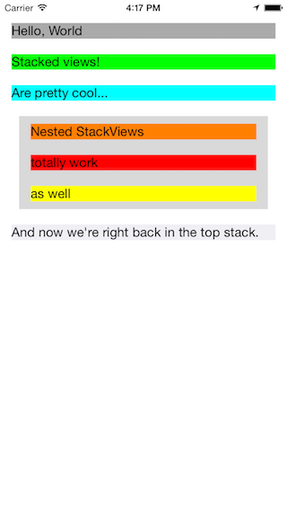

# BRYXStackView

[](https://travis-ci.org/Harlan Haskins/BRYXStackView)
[](http://cocoapods.org/pods/BRYXStackView)
[](http://cocoapods.org/pods/BRYXStackView)
[](http://cocoapods.org/pods/BRYXStackView)

## Usage

To run the example project, clone the repo, and run `pod install` from the Example directory first.

### Screenshot



## Requirements

iOS 8, if installing through CocoaPods, otherwise iOS 7.

## Installation

BRYXStackView is available through [CocoaPods](http://cocoapods.org). To install
it, simply add the following line to your Podfile:

```ruby
pod "BRYXStackView"
```

## Authors

Harlan Haskins, harlan@bryx.com

Adam Binsz, adam.binsz@bryx.com

## License

BRYXStackView is available under the MIT license. See the LICENSE file for more info.
